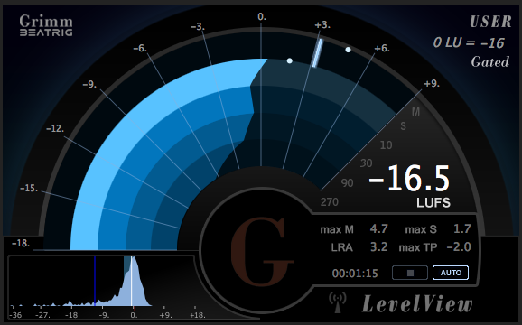
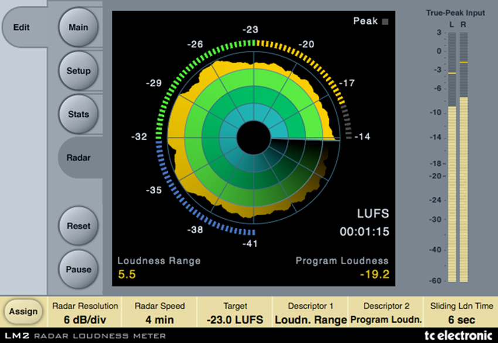
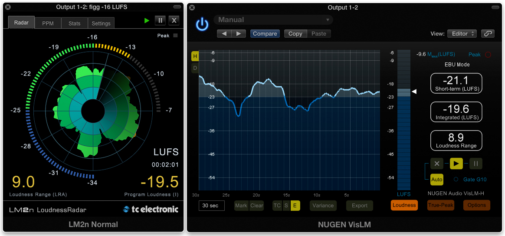
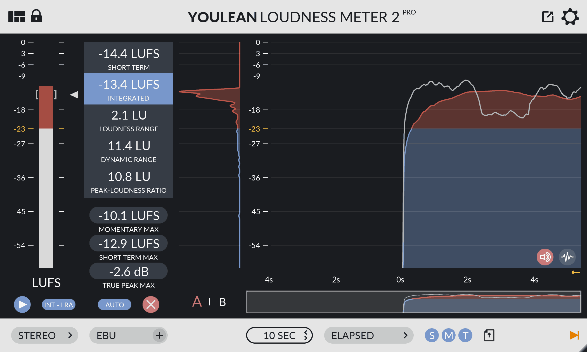

# On-Hertz | UI & Front-end Test

This repository is a skeleton to be used for your test. To start, follow the procedure below.

The repository contains several scss files, not all of them are necessarily useful, they contain the On-hertz graphic charter. Feel free to reuse what you think is necessary, to modify certain parts, or even to completely ignore what is superfluous.

## Project Setup

```sh
npm install
```

### Compile and Hot-Reload for Development

```sh
npm run dev
```

### Type-Check, Compile and Minify for Production

```sh
npm run build
```

### Lint files
```sh
npm run lint
```

## What we expect from you

You are going to create an audio level monitoring application. The skeleton set up plays an audio file and makes two pseudo measurements: [RMS](https://en.wikipedia.org/wiki/Root_mean_square) and [loudness](https://en.wikipedia.org/wiki/Loudness).

We would like you to represent these 2 measurements in the graphic form of a histogram (evolution of measurements over time) in a longitudinal or circular way. You will find some sources of inspiration below.

This histogram must have a minimum of interactivity with the mouse pointer. For example a popup showing the values ​​measured at the time pointed. In addition, the application must offer the possibility to adjust the time scale of the graph as well as allow it to be reset.

We will pay close attention to the visual result that you present to us. It is important that your code is clean and structured, but it is more about seeing how easily you can adopt a new technical stack, and what visual result you can produce.

## What we do not expect from this test

The precision and veracity of the measurements is of no importance for this test.

Furthermore, the refresh rate of the current measurements is very high, the refresh of the graph does not necessarily have to follow this rate.

**Go ahead, amaze us !**

## Examples

Here are some sources of inspiration. Do not reproduce them identically !








